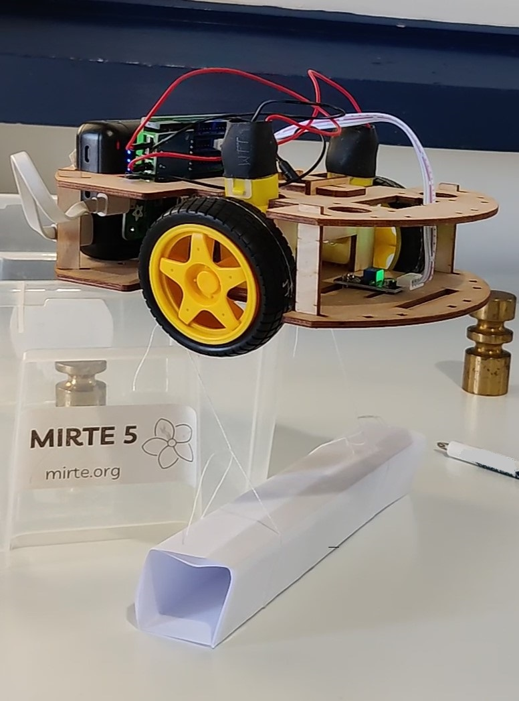

# Integration Test with MIRTE in-the-loop

Inspired by https://www.browserstack.com/guide/python-selenium-to-run-web-automation-test.

[Selenium](https://www.selenium.dev/) and [pytest](https://docs.pytest.org/) are used to run integration tests on the [MIRTE robot](https://mirte.org/) client website.

## Installation
To get started, create and activate a conda environment:
```sh
conda env create -f environment.yml
conda activate mirte-itl
```

## Usage
To run the tests, make sure that MIRTE is on and set up for physical testing.



Connect to MIRTE's WiFi and type the following:
```sh
pytest
```
There should be no errors and all tests should pass.

To mock the tests, run:
```sh
env MOCKING=True pytest
```
This will run the tests without connecting to MIRTE.

## Running the complete workflow
### Pre-requisites
1. [MIRTE basic](https://mirte.org/robots), fully assembled and set up for physical testing.
1. Main computer, used to update MIRTE and run the tests.
### Pre-requisites Main Computer (Windows)
1. [GitBash](https://git-scm.com/downloads)
1. [Anaconda](https://www.anaconda.com/products/distribution)
1. WiFi connection to a network with internet access
1. Connection to MIRTE's WiFi network
1. `mirte-in-the-loop` directory containing a clone of this repository. The startup will `pull` updates.
1. `.env.local` file with path, network and branch information. See `.example.env.local` for an example.

## Notes
- The IR sensor is sensitive to light. The tests will not work in bright environments.
- Useful commands:
    - `netsh wlan show networks  # Find networks`
    - `netsh wlan show profile  # Find profiles`
- Do not start in the `mirte-itl` conda environment. The workflow needs to delete and recreate this environment.
- Empty the logs directory regularly to avoid running out of disk space.
