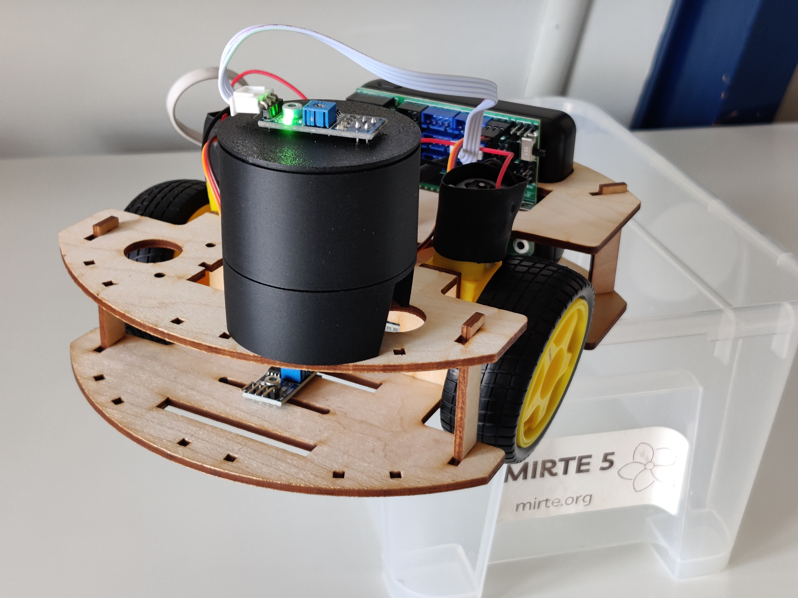
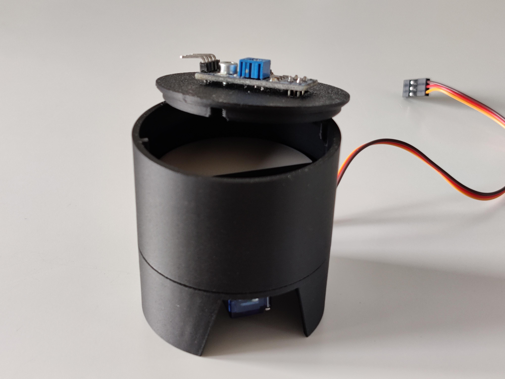

# Integration Test with MIRTE in-the-loop

Inspired by https://www.browserstack.com/guide/python-selenium-to-run-web-automation-test.

[Selenium](https://www.selenium.dev/) and [pytest](https://docs.pytest.org/) are used to run integration tests on the [MIRTE robot](https://mirte.org/) client website.



## Physical setup

You will need:
1. [MIRTE basic](https://mirte.org/robots), fully assembled and set up.
1. Test module. This is comprised of an IR sensor at the top of a light excluding cylinder. The sensor is the same as MIRTE's IR sensor and the connecting wire can be redirected to the test module. At the other end of the cylinder is a servo motor that turns a disk in the middle of the cylinder. Configure the test module's servo as described [in the documentation](https://docs.mirte.org/0.1.0/doc/configure_mirte.html). The disk has a white half and a black half. When the servo turns the disk, the IR sensor detects the colour of the disk. The connecting wires should be towards the white side of the disk for the tests to run successfully.
1. Main computer, used to update MIRTE and run the tests.



## Main Computer pre-requisites
1. [GitBash](https://git-scm.com/downloads)
1. [Anaconda](https://www.anaconda.com/products/distribution) or [Miniconda](https://www.anaconda.com/docs/getting-started/miniconda/main)
1. WiFi connection to a network with internet access
1. Connection to MIRTE's WiFi network
1. `mirte-in-the-loop` directory containing a clone of this repository.
1. `.env.local` file with path, network and branch information. See `.example.env.local` for an example.
1. Optional: Working keychain to enable `ssh` without entering a password:
```sh
ssh-keygen
ssh-copy-id mirte@mirte.local  # will ask for password
eval `ssh-agent -s`  # may only need to do this on Windows
ssh-add ~/.ssh/id_rsa  # or the path to your private key
ssh mirte@mirte.local
```

## Initial test
To get started, create and activate a conda environment on the main computer:
```sh
conda env create -f environment.yml
conda activate mirte-itl
```

To mock the tests, run:
```sh
env MOCKING=True pytest
```
This will run the tests without connecting to MIRTE.
There should be no errors and all tests should pass.

To run the tests on MIRTE, connect to MIRTE's WiFi and type the following:
```sh
pytest
```
There should be no errors and all tests should pass.


### Running the Workflow Script
To run the full test cycle, type the following command on the main computer:
```sh
bash ./startup.sh
```
`startup.sh` will pull the latest version of this repository and then start the `workflow.sh` script. `workflow.sh` takes care of the conda environment and network connections, and runs the `pytest`s in both mocking mode (on the main computer) and on MIRTE. All output is sent to a time-stamped file in the logs directory.

## Notes
- The IR sensor is sensitive to light. The tests will not work in bright environments.
- Useful commands (Windows):
    - `netsh wlan show networks  # Find networks`
    - `netsh wlan show profile  # Find profiles`
- If you are using a Raspberry Pi as the main computer, add these lines to the `~/.bashrc`, so that conda is activated and Selenium can find the Chrome WebDriver:
```sh
eval "$(/home/mirte/miniforge3/bin/conda shell.bash hook)"
export CHROMEWEBDRIVER=/usr/bin  # location that contains chromedriver
```
- Empty the logs directory regularly to avoid running out of disk space.
